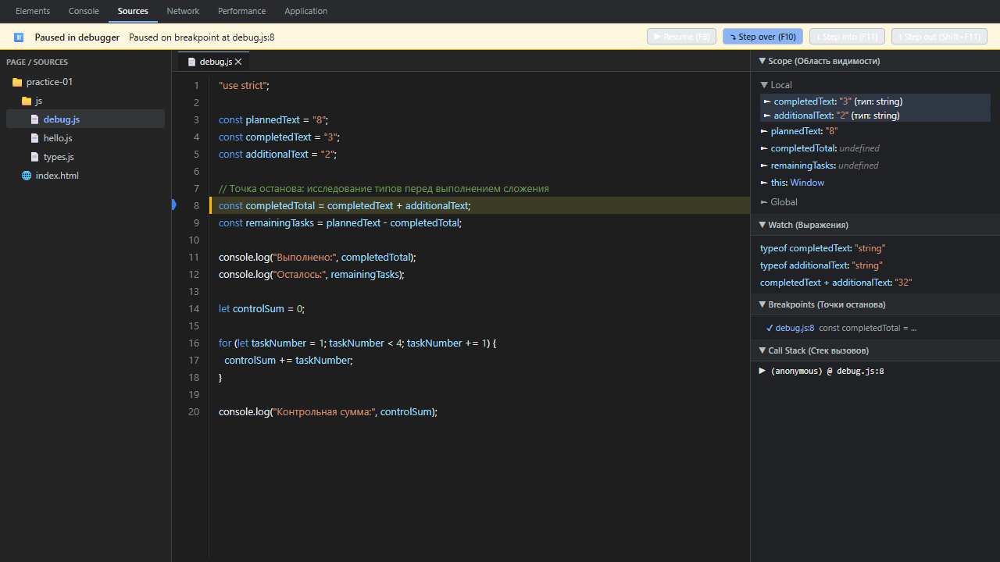

# Практическая работа № 1. Подготовка окружения и первые программы на JavaScript

## 1. Автор и вариант

- **Студент:** Студент
- **Группа:** Учебная группа
- **Вариант:** № 1
- **Параметры варианта:**
  - `totalTasks`: 12
  - `completedTasks`: 5
  - `dailyLimit`: 3

---

## 2. Окружение

| Параметр | Значение |
|---|---|
| Операционная система | Windows 11 |
| Среда выполнения Node.js | v24.14.0 (ветка 24 LTS) |
| Менеджер пакетов npm | 11.9.0 |
| Система контроля версий Git | 2.53.0.windows.1 |
| Браузер для отладки | Google Chrome 154.0.8037.57 / Microsoft Edge |

---

## 3. Команды запуска

Все команды выполняются из корня репозитория (`pr1`):

```bash
# Задание 1. Запуск первой программы в Node.js
node practice-01/js/hello.js

# Задание 2. Исследование типов и выражений
node practice-01/js/types.js

# Задание 3. Сводка задач и расчет прогресса
node practice-01/js/progress.js

# Задание 4. Пошаговое планирование по дням
node practice-01/js/plan.js

# Задание 5. Исправленная программа после отладки
node practice-01/js/debug.js

# Дополнительное задание. План с учетом выходных дней
node practice-01/js/plan-week.js
```

### Запуск в браузере
1. Открыть файл `practice-01/index.html` в браузере Google Chrome или Microsoft Edge.
2. Открыть панель разработчика клавишей `F12` (или комбинацией `Ctrl + Shift + I`).
3. Перейти на вкладку **Console (Консоль)** для просмотра результатов работы скрипта.
4. Для переключения задания достаточно изменить атрибут `src` в теге `<script src="./js/hello.js" defer></script>` (например, на `./js/progress.js`) и обновить страницу (`F5` или `Ctrl + R`).

---

## 4. Задание 1. Различие сред выполнения (Node.js и браузер)

Один и тот же файл `practice-01/js/hello.js` был запущен в среде Node.js и в браузере.

### Фактический вывод в Node.js:
```text
Студент: Студент
Группа: Учебная группа
Практическая работа: 1
JavaScript успешно запущен
Тип document: undefined
```

### Фактический вывод в консоли браузера:
```text
Студент: Студент
Группа: Учебная группа
Практическая работа: 1
JavaScript успешно запущен
Тип document: object
```

### Объяснение различия:
В Node.js глобальный объект `document` равен `undefined`, поскольку среда Node.js предназначена для серверного выполнения и не имеет встроенного графического окна и дерева HTML-документа (DOM). В браузере глобальный объект `document` доступен и имеет тип `object`, предоставляя интерфейс взаимодействия со структурой веб-страницы.

---

## 5. Задание 2. Исследование типов и преобразований

| № | Выражение | Ожидание до запуска | Фактическое значение | Тип результата | Объяснение |
|---:|---|---|---|---|---|
| 1 | `"8" + 2` | `"82"` | `"82"` | `string` | Бинарный оператор `+` при наличии хотя бы одного строкового операнда выполняет конкатенацию; число `2` неявно приводится к строке `"2"`. |
| 2 | `"8" - 2` | `6` | `6` | `number` | Оператор вычитания `-` не определен для строк, поэтому строка `"8"` неявно преобразуется в число `8`; `8 - 2 = 6`. |
| 3 | `Number("8") + 2` | `10` | `10` | `number` | Функция `Number("8")` явно преобразует строку в число `8`, после чего сложение двух чисел дает `10`. |
| 4 | `"12" > "3"` | `false` | `false` | `boolean` | Строки сравниваются посимвольно (лексикографически) по кодам символов. Код символа `'1'` (49) меньше кода символа `'3'` (51), поэтому `"12"` меньше `"3"`. |
| 5 | `12 === "12"` | `false` | `false` | `boolean` | Строгое равенство `===` проверяет совпадение значений без приведения типов; поскольку типы различаются (`number` и `string`), результат равен `false`. |
| 6 | `Number("")` | `0` | `0` | `number` | Согласно спецификации ECMAScript, явное числовое преобразование пустой строки (а также строки только из пробелов) дает `0`. |
| 7 | `Number("text")` | `NaN` | `NaN` | `number` | Строка `"text"` не содержит валидного числового представления, поэтому функция `Number()` возвращает специальное значение `NaN` (Not a Number). |
| 8 | `Boolean("false")` | `true` | `true` | `boolean` | При логическом преобразовании любая непустая строка преобразуется в `true`, независимо от ее текстового содержимого. |
| 9 | `typeof null` | `"object"` | `"object"` | `string` | Историческая ошибка в первой реализации JavaScript, зафиксированная в стандарте ради обратной совместимости. Значение `null` является примитивом, но `typeof null` возвращает строку `"object"`. Тип самого результата — `string`. |
| 10 | `typeof NaN` | `"number"` | `"number"` | `string` | `NaN` представляет собой специальное числовое значение в формате стандарта IEEE 754; оператор `typeof` возвращает для него строку `"number"`. Тип самого результата — `string`. |

---

## 6. Задание 3. Сводка выполнения задач (`progress.js`)

### Протокол проверок:

| Проверка | Входные данные (`totalTasks`, `completedTasks`) | Ожидаемый результат | Фактический результат | Итог |
|---|---|---|---|---|
| Вариант 1 (обычный расчет) | `12`, `5` | Всего: 12, Выполнено: 5, Осталось: 7, Прогресс: 41.7%, Статус: В работе | Всего: 12, Выполнено: 5, Осталось: 7, Прогресс: 41.7%, Статус: В работе | Пройдено |
| Граничный случай (нет задач) | `0`, `0` | `Задач пока нет` (без деления на ноль) | `Задач пока нет` | Пройдено |
| Граничный случай (не начато) | `5`, `0` | Всего: 5, Выполнено: 0, Осталось: 5, Прогресс: 0.0%, Статус: Не начато | Всего: 5, Выполнено: 0, Осталось: 5, Прогресс: 0.0%, Статус: Не начато | Пройдено |
| Граничный случай (все выполнены) | `5`, `5` | Всего: 5, Выполнено: 5, Осталось: 0, Прогресс: 100.0%, Статус: Завершено | Всего: 5, Выполнено: 5, Осталось: 0, Прогресс: 100.0%, Статус: Завершено | Пройдено |
| Некорректные данные (выполнено > всего) | `5`, `6` | `Ошибка: выполнено больше, чем существует.` | `Ошибка: выполнено больше, чем существует.` | Пройдено |
| Некорректные данные (отрицательное число) | `-1`, `0` | `Ошибка: количество задач не может быть отрицательным.` | `Ошибка: количество задач не может быть отрицательным.` | Пройдено |
| Некорректные данные (дробное значение) | `5`, `2.5` | `Ошибка: дробное количество задач.` | `Ошибка: дробное количество задач.` | Пройдено |
| Некорректные данные (строковый тип) | `"5"`, `2` | `Ошибка: вместо числа передана строка.` | `Ошибка: вместо числа передана строка.` | Пройдено |
| Некорректные данные (превышен предел) | `1001`, `0` | `Ошибка: превышена верхняя граница (максимум 1000).` | `Ошибка: превышена верхняя граница (максимум 1000).` | Пройдено |
| Некорректные данные (NaN) | `NaN`, `0` | `Ошибка: недопустимое числовое значение.` | `Ошибка: недопустимое числовое значение.` | Пройдено |

---

## 7. Задание 4. План выполнения задач по дням (`plan.js`)

### Протокол проверок:

| Проверка | Входные данные (`total`, `completed`, `limit`) | Ожидаемый результат | Фактический результат | Итог |
|---|---|---|---|---|
| Вариант 1 (обычный случай) | `12`, `5`, `3` | Осталось: 7; День 1: 3 (ост 4); День 2: 3 (ост 1); День 3: 1 (ост 0); Потребуется: 3 дня | 3 дня; в последний день выполнена 1 задача | Пройдено |
| Ровное деление по норме | `10`, `4`, `3` | Осталось: 6; 2 дня по 3 задачи; Потребуется: 2 дня | 2 дня, по 3 задачи в день | Пройдено |
| Норма превышает остаток | `5`, `3`, `10` | Осталось: 2; День 1: выполнено 2, осталось 0; Потребуется: 1 день | 1 день, выполнено 2 задачи | Пройдено |
| Все задачи уже выполнены | `5`, `5`, `2` | Осталось: 0; Все задачи уже выполнены; Потребуется: 0 дней | 0 дней; цикл не запускается | Пройдено |
| Исходно нет задач | `0`, `0`, `2` | Осталось: 0; Все задачи уже выполнены; Потребуется: 0 дней | 0 дней; цикл не запускается | Пройдено |
| Недопустимая норма (ноль) | `5`, `2`, `0` | `Ошибка: дневная норма должна быть не менее 1.` | Ошибка; цикл не запускается | Пройдено |
| Недопустимая норма (дробная) | `5`, `2`, `1.5` | `Ошибка: дробной дневной нормы быть не должно.` | Ошибка: дробной дневной нормы быть не должно. | Пройдено |
| Некорректно выполненных задач | `5`, `6`, `2` | `Ошибка: некорректное число выполненных задач.` | Ошибка: некорректное число выполненных задач. | Пройдено |
| Недопустимая норма (строка) | `5`, `2`, `"2"` | `Ошибка: дневная норма задана строкой.` | Ошибка: дневная норма задана строкой. | Пройдено |
| Превышение предела нормы | `5`, `2`, `1001` | `Ошибка: превышена верхняя граница нормы.` | Ошибка: превышена верхняя граница нормы. | Пройдено |

---

## 8. Задание 5. Поиск логических ошибок через DevTools (`debug.js`)

### Сравнение результатов выполнения:

- **Исходный вывод программы с ошибками:**
  ```text
  Выполнено: 32
  Осталось: -24
  Контрольная сумма: 6
  ```
- **Фактический вывод после исправления:**
  ```text
  Выполнено: 5
  Осталось: 3
  Контрольная сумма: 10
  ```

### Таблица найденных и устраненных ошибок:

| Ошибка | Что наблюдалось | Причина | Исправление | Результат после исправления |
|---|---|---|---|---|
| Обработка строковых данных задач | Вместо суммы `5` получалось `"32"`, а остаток становился отрицательным `-24`. | Исходные данные были заданы строками (`"3"` и `"2"`). Оператор `+` выполнил конкатенацию строк. Последующее вычитание `"8" - "32"` привело к неявному преобразованию и дало `-24`. | Добавлено явное числовое преобразование операндов через `Number()`: `Number(completedText) + Number(additionalText)` и `Number(plannedText) - completedTotal`. | `Выполнено: 5`, `Осталось: 3`. |
| Граница цикла контрольной суммы | Контрольная сумма равнялась `6` вместо `10`. | В условии цикла использовалось строгое неравенство `taskNumber < 4`. На 4-й итерации цикл завершался, сложив только `1 + 2 + 3 = 6`. | Условие изменено на нестрогое неравенство `taskNumber <= 4` для включения граничного значения `4`. | `Контрольная сумма: 10`. |

### Иллюстрация процесса отладки (Точка останова в Chrome DevTools):



*На снимке экрана зафиксирован останов отладчика на строке 8 файла `debug.js`. В правой панели (раздел Scope) отчетливо видны исходные типы переменных `completedText: "3"` и `additionalText: "2"` как строки (`string`), что подтверждает причину строковой конкатенации.*

---

## 9. Дополнительное задание. Вариант Б — План с выходными днями (`plan-week.js`)

### Описание реализации:
- Первый календарный день считается понедельником (`dayOfWeek = 1`).
- Номер дня недели определяется циклически: `((calendarDays - 1) % 7) + 1`.
- Дни 6 (суббота) и 7 (воскресенье) являются выходными; дневная норма в них не расходуется, задачи не выполняются.
- Выходные дни после полного завершения задач не добавляются (цикл завершается в день выполнения последней задачи).
- При отсутствии задач оба счетчика дней равны 0.

### Протокол проверок:

| Тестовый сценарий | Входные данные (`total`, `completed`, `limit`) | Ожидаемый результат | Фактический результат | Итог |
|---|---|---|---|---|
| **Контрольный случай из методички** | `6`, `0`, `1` | 6 рабочих дней, 8 календарных дней (пн-пт работа, сб-вс отдых, пн завершение) | 6 рабочих дней, 8 календарных дней | Пройдено |
| **Собственный тест 1: завершение в середине недели** | `3`, `0`, `1` | 3 рабочих дня, 3 календарных дня (пн, вт, ср; выходные не затрагиваются) | 3 рабочих дня, 3 календарных дня | Пройдено |
| **Собственный тест 2: завершение в пятницу** | `10`, `0`, `2` | 5 рабочих дней, 5 календарных дней (пн-пт по 2 задачи; завершено ровно до субботы) | 5 рабочих дней, 5 календарных дней | Пройдено |
| **Собственный тест 3: работа с переходом выходных** | `12`, `0`, `2` | 6 рабочих дней, 8 календарных дней (5 дней работы + 2 выходных + 1 рабочий день) | 6 рабочих дней, 8 календарных дней | Пройдено |
| **Собственный тест 4: задачи уже выполнены** | `5`, `5`, `2` | 0 рабочих дней, 0 календарных дней | 0 рабочих дней, 0 календарных дней | Пройдено |

---

## 10. Ответы на контрольные вопросы

1. **Чем язык JavaScript отличается от среды Node.js? Почему `document` доступен не в обоих запусках?**  
   JavaScript — это стандарт языка программирования (ECMAScript). Среда выполнения (браузер или Node.js) предоставляет движок для исполнения JS-кода и набор платформенных API. Объект `document` — это часть Web API браузера (DOM), предназначенная для работы со структурой HTML-документа. В Node.js нет графического окна и DOM, поэтому `document` не определен (`undefined`).

2. **Когда нужно использовать `const`, а когда `let`? Что именно запрещает `const`?**  
   `const` используется по умолчанию для всех переменных, значение которых не требует повторного присваивания. `let` используется только для переменных, значение которых целенаправленно меняется (счетчики, накопители, флаги). `const` запрещает повторное связывание (переприсваивание идентификатора новому значению через оператор `=`).

3. **Чем отличаются число `12` и строка `"12"`?**  
   Число `12` принадлежит к типу `number` и хранится в памяти в бинарном формате чисел с плавающей точкой (IEEE 754), участвуя в арифметических операциях. Строка `"12"` принадлежит к типу `string`, представляет собой последовательность символов UTF-16 и при сложении через `+` участвует в строковой конкатенации, а не сложении.

4. **Почему сложение строки и числа может дать результат, не похожий на арифметическую сумму?**  
   В JavaScript оператор `+` перегружен: если хотя бы один из операндов является строкой, второй операнд автоматически неявно преобразуется в строку, и выполняется конкатенация (объединение строк), а не сложение. Например, `"8" + 2` дает строку `"82"`.

5. **Чем проверка `===` отличается от сравнения с преобразованием типов?**  
   Оператор строгого равенства `===` сравнивает значения без приведения их типов. Если типы различаются (например, `12 === "12"`), операция немедленно возвращает `false`. Оператор нестрогого равенства `==` предварительно пытается привести типы по сложным правилам абстрактного сравнения, что может приводить к неочевидным логическим ошибкам.

6. **Почему `Number("")` нельзя считать достаточной проверкой корректности ввода?**  
   По спецификации JavaScript вызов `Number("")` для пустой строки, а также для строки, состоящей исключительно из пробелов, возвращает `0`, а не ошибку или `NaN`. Поэтому пустой ввод ошибочно будет воспринят программой как валидное число `0`.

7. **Почему `typeof value === "number"` недостаточно для проверки количества задач?**  
   Оператор `typeof` возвращает `"number"` не только для корректных положительных целых чисел, но и для `NaN`, `Infinity`, `-Infinity`, а также дробных чисел (например, `2.5`). Поэтому для проверки бизнес-логики необходимо дополнительно проверять `Number.isInteger(value)`, а также допустимый диапазон значений (`value >= 0 && value <= 1000`).

8. **В каком порядке нужно обрабатывать некорректный ввод, отсутствие задач и обычный расчёт процента?**  
   1. Сначала проверяется корректность типов данных и допустимость значений (валидация на ошибки). При ошибке выполнение расчета прерывается.  
   2. Затем проверяется граничный случай отсутствия задач (`total === 0 && completed === 0`), выводя сообщение «Задач пока нет» без вычисления процента (во избежание деления на ноль `0/0 = NaN`).  
   3. Только для валидных положительных данных выполняется обычный расчет остатка, процента выполнения и статуса.

9. **За счёт чего цикл планирования заканчивается? Что произойдёт без проверки `dailyLimit`?**  
   Цикл заканчивается за счет того, что на каждой итерации переменная `remainingTasks` строго уменьшается на количество выполненных за день задач (`tasksToday`), приближая условие `remainingTasks > 0` к завершению. Если не проверить `dailyLimit` и допустить `dailyLimit <= 0`, остаток задач перестанет уменьшаться, что вызовет бесконечный цикл и зависание программы.

10. **Почему последняя итерация может отличаться от предыдущих и как это учитывает ваше решение?**  
    В последний день количество оставшихся задач может оказаться меньше установленного суточного лимита. Наше решение учитывает это с помощью вызова `Math.min(dailyLimit, remainingTasks)`, гарантируя, что за день будет выполнено ровно столько задач, сколько фактически осталось, а остаток не уйдет в отрицательные числа.

11. **Что даёт точка останова по сравнению с одним итоговым `console.log()`?**  
    Точка останова полностью приостанавливает выполнение программы в заданной строке, позволяя проинспектировать текущее состояние всех переменных, их типы в панели Scope, оценить стек вызовов (Call Stack) и пошагово наблюдать каждую итерацию и изменение памяти до того, как ошибка исказит итоговый результат.

12. **Чем отличаются сохранение файла, Git-коммит и отправка изменений на GitHub?**  
    - **Сохранение файла:** запись изменений из оперативной памяти редактора на локальный диск компьютера.
    - **Git-коммит:** создание снимка состояния отслеживаемых файлов в локальной базе данных репозитория (`.git`) с сохранением авторства, даты и описания изменений.
    - **Отправка (git push):** передача накопленных локальных коммитов на удаленный сервер (например, GitHub) для синхронизации и предоставления доступа другим участникам или преподавателю.

---

## 11. Выводы по работе

В ходе выполнения практической работы № 1:
1. Подготовлено и проверено рабочее окружение на базе актуальной ветки Node.js 24 LTS, npm и Git в ОС Windows.
2. Изучены различия сред выполнения: работа JavaScript в среде браузера с доступом к Web DOM API (`typeof document === "object"`) и в среде Node.js (`typeof document === "undefined"`).
3. Проанализированы правила явного и неявного преобразования типов, особенности операторов `+`, `-`, строгого равенства `===` и посимвольного сравнения строк.
4. Разработаны алгоритмы валидации и расчета прогресса задач (`progress.js`) и пошагового планирования по дням (`plan.js`) с обработкой граничных и ошибочных входных данных.
5. Освоена техника отладки программного кода с использованием точек останова (breakpoints) и панели Scope в Chrome DevTools на примере исправления ошибок в `debug.js`.
6. Выполнено дополнительное задание повышенной сложности (`plan-week.js`) по расчету календарного графика с учетом рабочих и выходных дней, успешно прошедшее контрольные и пользовательские тесты.
