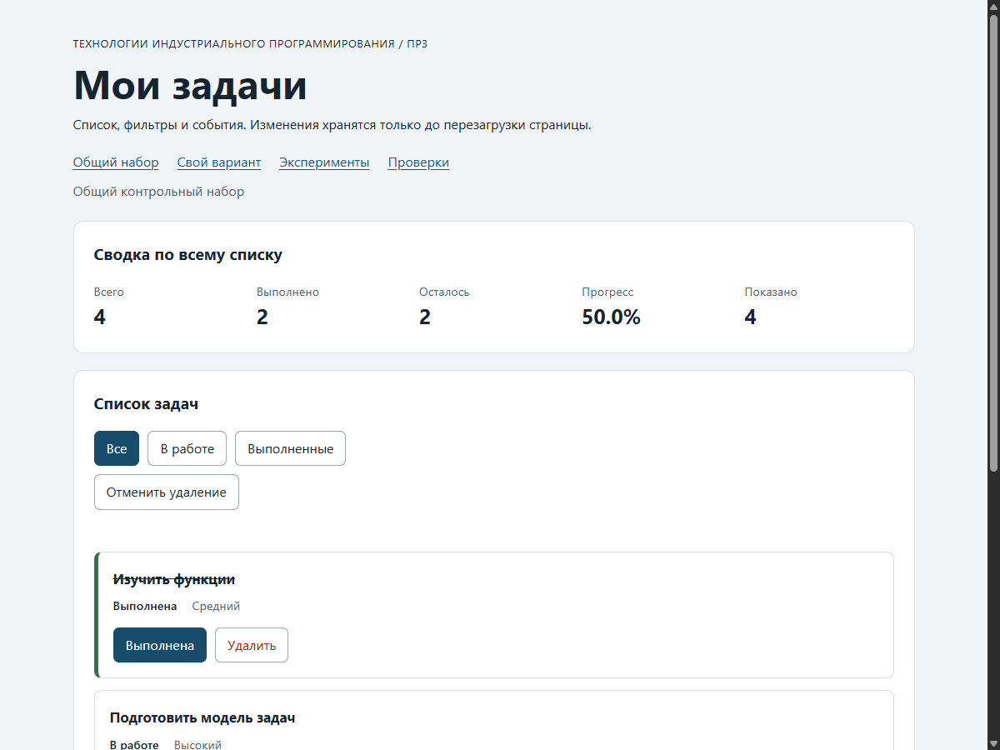

# Практическая работа № 3. Работа с DOM и событиями

## Данные работы

| Поле | Значение |
|---|---|
| Имя | Сидорович Денис Сергеевич |
| Группа | ЭФБО-17-25 |
| Вариант из ПР2 | 7 («Подготовка учебного релиза», $N = 23$, формула: `((23 - 1) % 8) + 1 = 7`) |
| Node.js | v24.14.0 |
| Браузер | Microsoft Edge 154.0.4258.53 |
| Операционная система | Windows 11 (NT 10.0.26300.0) |

## Запуск

Рабочая папка: `practice-03` внутри личного репозитория `tip-js-practices`.

```bash
# Проверка сервисных функций ПР2
npm run check:service

# Запуск локального HTTP-сервера
npm start
```

Доступные адреса при запущенном сервере:
```text
http://127.0.0.1:5503/                          # Общий контрольный набор
http://127.0.0.1:5503/index.html?dataset=variant # Индивидуальный вариант 7
http://127.0.0.1:5503/examples/dom-events.html   # Лабораторные эксперименты с DOM
http://127.0.0.1:5503/checks.html                # Браузерные автоматизированные проверки
```

Остановка сервера: `Ctrl+C`.

## Что перенесено из ПР2

Из директории `practice-02/src/` перенесены два ключевых файла:
1. `src/task-service.js` — модуль чистых прикладных функций модели (`createTask`, `findTaskById`, `getPendingTasks`, `getTaskTitles`, `getTaskStats`, `addTask`, `setTaskCompleted`, `renameTask`, `removeTask`). Все функции работают без мутаций входных массивов и не обращаются к глобальному объекту `document`.
2. `src/data.js` — эталонные данные: общий набор `demoTasks` (4 задачи с id `1, 4, 7, 10`) и индивидуальный набор Варианта 7 `variantTasks` (6 задач с id `11, 23, 37, 41, 58, 64`, все изначально выполненные $K = 6$).

Результат повторной проверки в новом окружении: успешно пройдены **все 35 проверок из 35** (`npm run check:service`). Доработок логики сервиса не потребовалось.

## Эксперименты

| № | До запуска: прогноз | После запуска: результат | Объяснение |
|---:|---|---|---|
| 1. Отсутствующий элемент и коллекция | `querySelector` вернёт `null`, обращение к свойству вызовет ошибку; `querySelectorAll` вернёт пустой `NodeList` длиной 0, обращение к `.length` безопасно | `null` и `0` | Одиночный селектор при отсутствии возвращает примитив `null`, а множественный селектор — объект коллекции `NodeList` (хотя и пустой). |
| 2. dataset и числовой id | `dataset.taskId` вернёт строку `"23"` (тип string); `Number(...)` вернёт число 23 (тип number) | `"23"` (string) и `23` (number) | Все атрибуты `data-*` читаются через DOM API как строки; для работы со строгой бизнес-логикой числового id необходимо явное преобразование `Number()`. |
| 3. Статический NodeList | `initialItems.length` останется 1, а новый `querySelectorAll` покажет 3 после двух добавлений | Старый `NodeList`: 1; новый `querySelectorAll`: 3 | `querySelectorAll` возвращает статический снимок дерева элементов; добавление новых узлов в DOM не мутирует ранее сохранённую коллекцию. |
| 4. Строка с HTML-разметкой | `textContent` отобразит строку с тегами буквально; тег `<strong>` не превратится в жирный текст, `children.length` останется 0 | `<strong>Это текст, а не HTML</strong>`, дочерних HTML-элементов 0 | `textContent` вставляет текст без HTML-парсинга, предотвращая непреднамеренное создание DOM-узлов и XSS-уязвимости. |
| 5. Распространение события | При клике по вложенному `span` порядок фаз: capture на card (phase=1), bubbling на button (phase=3), bubbling на card (phase=3); target везде `lab-label` | 1. phase=1; target=lab-label; currentTarget=lab-card<br>2. phase=3; target=lab-label; currentTarget=lab-button<br>3. phase=3; target=lab-label; currentTarget=lab-card | Событие клика проходит погружение (capture) и всплытие (bubbling). Цель `target` остаётся фактическим элементом клика (`span`), а `currentTarget` указывает на текущего слушателя. Для кнопок с иконками/текстом нужен `.closest()`. |

## Организация кода

- `src/data.js` — содержит эталонные данные `demoTasks`, индивидуальный набор `variantTasks` и номер варианта `variantNumber = 7`. Не выполняет операций с DOM.
- `src/task-service.js` — изолированная бизнес-логика манипуляции задачами из ПР2. Не знает о DOM и структуре страниц.
- `src/task-selectors.js` — модуль чистой фильтрации `getVisibleTasks(tasks, filter)`. Принимает массив и возвращает новый массив для режимов `'all'`, `'pending'`, `'completed'`, не меняя входные объекты.
- `src/task-view.js` — создание и обновление DOM-структур (`createTaskElement`, `renderTaskList`, `renderSummary`, `renderEmptyState`). Использует исключительно стандартные методы DOM (`createElement`, `textContent`, `replaceChildren`, `classList`) без небезопасного `innerHTML`.
- `src/main.js` — точка входа и координатор приложения. Хранит состояние:
  - `currentTasks` — актуальный полный массив задач;
  - `currentFilter` — активный режим фильтрации;
  - `lastDeleted` — сохранённая задача для отмены удаления (дополнительное задание).
  Здесь зарегистрированы делегированные слушатели событий на контейнерах `elements.list` (`ul#task-list`) и `elements.filters` (`#task-filters`), а также кнопке отмены.

## Общий сценарий

Проверка сценария шагов 0–7 раздела 6.5 методички на наборе `demoTasks` (`[1, 4, 7, 10]`):

| Шаг | Видимые id | Всего | Выполнено | Осталось | Прогресс | Показано | Сообщение | Совпало с ожиданием |
|---:|---|---|---|---|---|---|---|---|
| 0 | `[1, 4, 7, 10]` | 4 | 2 | 2 | `50.0%` | 4 | `""` | Да |
| 1 | `[4, 7]` | 4 | 2 | 2 | `50.0%` | 2 | `""` | Да |
| 2 | `[7]` | 4 | 3 | 1 | `75.0%` | 1 | `""` | Да |
| 3 | `[1, 4, 7, 10]` | 4 | 3 | 1 | `75.0%` | 4 | `""` | Да |
| 4 | `[1, 4, 10]` | 3 | 3 | 0 | `100.0%` | 3 | `""` | Да |
| 5 | `[]` | 3 | 3 | 0 | `100.0%` | 0 | `Нет задач по выбранному фильтру.` | Да |
| 6 | `[1, 4, 10]` | 3 | 2 | 1 | `66.7%` | 3 | `""` | Да |
| 7 | `[]` | 0 | 0 | 0 | `0.0%` | 0 | `Список задач пуст.` | Да |

После перезагрузки страницы: состояние возвращается к шагу 0 (`demoTasks`), так как в рамках ПР3 сохранение состояния между сессиями (LocalStorage / API) не предусмотрено.

## Индивидуальный вариант

- **Вариант:** 7
- **Тематика:** «Подготовка учебного релиза»
- **Исходные задачи:** 6 задач с идентификаторами `[11, 23, 37, 41, 58, 64]`, изначально все выполнены ($K = 6$, прогресс $100.0\%$).
- **Действия:**
  1. Переключение статуса задачи `23` (`completed` становится `false`).
  2. Удаление задачи `37` (была `completed: true`).

| Этап | Всего | Выполнено | Осталось | Прогресс | Видимые id |
|---|---|---|---|---|---|
| До действий | 6 | 6 | 0 | `100.0%` | `[11, 23, 37, 41, 58, 64]` |
| После переключения 23 | 6 | 5 | 1 | `83.3%` | `[11, 23, 37, 41, 58, 64]` |
| После удаления 37 | 5 | 4 | 1 | `80.0%` | `[11, 23, 41, 58, 64]` |
| Итог, фильтр «В работе» | 5 | 4 | 1 | `80.0%` | `[23]` |
| Итог, фильтр «Выполненные» | 5 | 4 | 1 | `80.0%` | `[11, 41, 58, 64]` |

Итоговый прогресс $80.0\%$ и состав оставшихся идентификаторов `[11, 23, 41, 58, 64]` строго соответствуют контрольным значениям методички.

## Протокол проверки сервиса

Фактический вывод запуска `npm run check:service`:

```text
> tip-js-practice-03@1.0.0 check:service
> node checks/service.checks.js

OK: 01. Создание задачи с явным приоритетом
OK: 02. Приоритет по умолчанию
OK: 03. Удаление краевых пробелов без изменения внутренних
OK: 04. Граничные длины названия и положительный безопасный id
OK: 05. Некорректные названия при создании
OK: 06. Некорректные идентификаторы при создании
OK: 07. Все допустимые приоритеты и отклонение недопустимых
OK: 08. Каждый вызов createTask возвращает новый объект
OK: 09. Поиск по id, а не по индексу
OK: 10. Отсутствующая задача и пустой массив при поиске
OK: 11. Поиск не преобразует строковый id в число
OK: 12. Получение невыполненных задач
OK: 13. Пустой список, все выполнены и все не выполнены
OK: 14. Названия в исходном порядке и пустой список
OK: 15. Сводка по общему набору
OK: 16. Сводка по пустому списку
OK: 17. Сводка: ничего не выполнено и выполнено всё
OK: 18. Процент остаётся числом без предварительного округления
OK: 19. Добавление в конец без изменения входного массива
OK: 20. Добавление в пустой список с приоритетом по умолчанию
OK: 21. Повторяющийся id отклоняется
OK: 22. Добавление не обходит проверки createTask
OK: 23. Изменение completed в обе стороны
OK: 24. completed принимает только boolean
OK: 25. Некорректный или отсутствующий id при изменении статуса
OK: 26. Повторная установка статуса создаёт новый результат
OK: 27. Переименование сохраняет остальные поля
OK: 28. Проверки названия при переименовании
OK: 29. Некорректный или отсутствующий id при переименовании
OK: 30. Удаление по id с сохранением порядка
OK: 31. Удаление единственной записи
OK: 32. Некорректный, отсутствующий id и удаление из пустого списка
OK: 33. Входные объекты не изменяются ни одной операцией
OK: 34. Общий сценарий и все промежуточные сводки
OK: 35. Работа с другим набором, без зависимости от demoTasks

Проверок пройдено: 35; не пройдено: 0.
```

## Протокол браузерных проверок

Фактический текст из блока «Текстовый протокол» со страницы `http://127.0.0.1:5503/checks.html`:

```text
OK: Фильтр all возвращает новый массив в исходном порядке
OK: Фильтр pending выбирает невыполненные задачи
OK: Фильтр completed выбирает выполненные задачи
OK: Все три фильтра работают с пустым списком
OK: Фильтрация не меняет входные записи и их порядок
OK: Карточка — li.task-card с числовым id в dataset
OK: Статус невыполненной карточки и aria-pressed согласованы
OK: Статус выполненной карточки и aria-pressed согласованы
OK: В карточке две обычные кнопки с вложенными подписями
OK: Все приоритеты отображаются по установленному словарю
OK: Название с разметкой отображается текстом
OK: Отрисовка списка создаёт карточки в исходном порядке
OK: Повторная отрисовка не накапливает карточки
OK: Контейнер списка и его обработчик сохраняются
OK: Отрисовка пустого массива очищает прежние карточки
OK: Сводка считается по всему списку, отдельно выводится Показано
OK: Пустая сводка не содержит NaN и Infinity
OK: Сообщение для полностью пустого списка
OK: Сообщение для пустого результата фильтра
OK: Появление карточек скрывает прежнее пустое состояние
OK: Приложение: начальный набор и сводка
OK: Приложение: фильтр срабатывает по клику на вложенный span
OK: Приложение: активный фильтр отмечен классом и aria-pressed
OK: Приложение: фильтрация не удаляет скрытые задачи
OK: Приложение: переключение по id, а не индексу массива
OK: Приложение: выполненная задача исчезает из фильтра В работе
OK: Приложение: удаление изменяет данные, а не только DOM
OK: Приложение: клик по названию не изменяет данные
OK: Приложение: после перерисовок одно нажатие — одно изменение
OK: Приложение: удаление всех записей и нулевая сводка
OK: Приложение: нет совпадений — не то же самое, что нет задач
OK: Приложение: неизвестный числовой id не меняет данные
OK: Приложение: id 4abc не превращается в 4
OK: Приложение: неизвестное действие игнорируется
OK: Приложение: после изменения сохраняется клавиатурный фокус
OK: Приложение: новая загрузка возвращает исходное состояние

Всего: 36. Пройдено: 36. Ошибок: 0.
```

## Собственные проверки

| № | Исходное состояние и действия | Ожидаемый результат | Фактический результат | Итог |
|---:|---|---|---|---|
| 1 | Граничное состояние: у карточки в DOM вручную изменён `data-task-id="999"` (несуществующий id) и нажат клик по кнопке «Удалить» | Массив задач не меняется, в `#operation-message` выводится «Задача с id 999 не найдена», после смены фильтра сообщение стирается | Сообщение выведено, массив `currentTasks` остался без изменений, при клике на фильтр сообщение очищено | Пройдено |
| 2 | События и отрисовка: переключение задачи `4` в фильтре «В работе», проверка автоматического переноса фокуса | Задача `4` становится выполненной и исчезает из выборки «В работе», фокус переносится на кнопку активного фильтра `[data-filter="pending"]` | Карточка скрыта из текущего вида, клавиатурный фокус корректно перешёл на активный фильтр, `activeElement.dataset.filter === "pending"` | Пройдено |
| 3 | Изоляция эталона: удаление всех 4 задач в приложении через UI, проверка состояния исходного `demoTasks` | `currentTasks` становится пустым `[]`, однако экспортированный `demoTasks` в `src/data.js` по-прежнему содержит все 4 задачи | Исходный массив `demoTasks` не подвергся мутациям, длина осталась равна 4 | Пройдено |

## Отладка и клавиатура

- **Точка останова DevTools:** строка входа в `handleTaskListClick` модуля `src/main.js`:
  - `event.target`: элемент `<span class="action-label">Выполнена</span>`;
  - `event.currentTarget`: элемент `<ul id="task-list">`;
  - `button`: `event.target.closest("button[data-action]")` вернул `<button data-action="toggle">`;
  - `card.dataset.taskId`: строковое значение `"4"`;
  - числовой `id`: `4` (результат `Number("4")`, проверка `isSafeInteger` пройдена);
  - действие: `"toggle"`;
  - результат сервиса `setTaskCompleted`: `{ ok: true, tasks: [...] }`.

- **Проверка клавиатурного управления:**
  - Клавиша `Tab` последовательно перебирает ссылки шапки, кнопки фильтров, кнопку отмены и кнопки действий внутри карточек.
  - Клавиши `Enter` и `Пробел` активируют выбранные кнопки.
  - Фокус после действия: при переключении статуса фокус сохраняется на кнопке той же задачи (`toggle`), а при удалении задачи или исчезновении карточки из-за фильтрации функция `restoreTaskFocus` корректно переводит фокус на активную кнопку фильтра.
  - При установке `data-task-id="777"` фиксируется сообщение об отсутствии задачи, при `data-task-id="4abc"` срабатывает проверка `!Number.isSafeInteger(NaN)` и выводится сообщение «Некорректный идентификатор задачи».

## Вид приложения

Скриншот работающего интерфейса приложения (общий контрольный набор с фильтрами, сводкой и дополнительным действием отмены удаления):



## Дополнительное задание

Выполнен **Вариант Б: Однократная отмена последнего удаления**.

### Правила поведения:
1. При удалении любой задачи через кнопку «Удалить» удаляемый объект и его исходный индекс в массиве сохраняются в переменной `lastDeleted`.
2. Кнопка «Отменить удаление» (`#undo-delete-btn`) становится активной (`disabled = false`).
3. При нажатии «Отменить удаление» задача возвращается в массив `currentTasks` строго на прежнюю позицию через `splice`, после чего кнопка отмены снова блокируется (`disabled = true`).
4. Изменения статусов других задач, выполненные в промежутке между удалением и отменой, сохраняются.
5. Новое удаление заменяет объект отмены.

### Проверки поведения отмены удаления:

| № | Исходное состояние и действия | Ожидаемый результат | Фактический результат | Итог |
|---:|---|---|---|---|
| 1 | Удаление первой задачи (`id = 1`) и нажатие «Отменить удаление» | Задача `1` удаляется, затем возвращается на индекс 0 первым элементом списка; кнопка отмены становится неактивной | Задача `1` восстановлена на первой позиции, порядок сохранён, кнопка disabled | Пройдено |
| 2 | Удаление задачи `4`, переключение статуса задачи `7`, затем нажатие «Отменить удаление» | Задача `4` восстанавливается на свой исходный индекс 1, при этом задача `7` остаётся выполненной | Задача `4` на месте, статус задачи `7` не сбросился | Пройдено |
| 3 | Удаление всех задач до пустого списка и нажатие «Отменить удаление», затем попытка повторного клика | Восстанавливается последняя удалённая задача, при повторном клике ничего не происходит | Список содержит восстановленную задачу, повторная отмена заблокирована | Пройдено |

## Ответы на контрольные вопросы

1. **Чем исходный HTML отличается от текущего DOM документа?**  
   HTML — это статический текст разметки (сериализованный формат). DOM — это динамическое дерево живых объектов в оперативной памяти браузера, создаваемое парсером HTML и доступное для чтения и модификации из JavaScript во время работы страницы.
2. **Что возвращают `querySelector` и `querySelectorAll`, если совпадений нет?**  
   `querySelector` возвращает примитивное значение `null`. `querySelectorAll` возвращает пустую коллекцию `NodeList` с длиной `0`.
3. **Почему сохранённый `NodeList` не увеличился после добавления элемента?**  
   Потому что `querySelectorAll` возвращает статический снимок (static NodeList). Он фиксирует состояние элементов на момент вызова метода и не подписывается на последующие изменения дерева DOM.
4. **Чем создание элемента отличается от его добавления в документ?**  
   Создание (`document.createElement`) выделяет узел в оперативной памяти, но узел ещё не присоединён к дереву документа (`isConnected === false`). Добавление (`append`, `replaceChildren`) встраивает узел в иерархию документа, после чего он отображается на странице.
5. **Почему `textContent` подходит для названия задачи, а `innerHTML` здесь не используется?**  
   `textContent` безопасно вставляет строку как сырой текст, не разбирая угловые скобки и теги, что исключает появление непреднамеренной разметки и защищает от XSS-уязвимостей при выводе пользовательских данных.
6. **Чем отличаются `event.target` и `event.currentTarget` при нажатии на вложенный `span`?**  
   `event.target` указывает на исходный целевой элемент, на котором непосредственно произошло событие (вложенный `span`). `event.currentTarget` указывает на элемент, на котором в данный момент зарегистрирован и выполняется обработчик события (`button` или `ul`).
7. **Зачем нужны всплытие, `closest` и проверка принадлежности контейнеру?**  
   Всплытие позволяет делегировать обработку множества дочерних элементов общему родительскому контейнеру. `closest` поднимается по цепочке предков от фактической цели клика до нужной кнопки, а проверка принадлежности контейнеру гарантирует, что элемент не находится за пределами целевого блока.
8. **Почему идентификатор из `dataset` преобразуется в число, а статус читается из массива?**  
   В `dataset` все значения хранятся в виде строк, тогда как бизнес-логика строго ожидает положительное безопасное целое число (`number`). Статус читается из массива, так как источником истины является модель данных приложения, а не временные визуальные атрибуты DOM.
9. **Почему нельзя использовать `id` как индекс или частично разбирать `4abc` как число?**  
   Идентификаторы задач не обязаны совпадать с индексами массива (в общем наборе id: 1, 4, 7, 10, а индексы: 0, 1, 2, 3). Использование `parseInt` преобразует строку `"4abc"` в `4`, что замаскирует ошибку повреждённых данных; строгая валидация через `Number(...)` и `Number.isSafeInteger(...)` даёт `NaN` и предотвращает нежелательные мутации.
10. **Почему обработчики вынесены за пределы `renderApp`?**  
    Если регистрировать обработчики внутри `renderApp`, то при каждой перерисовке на контейнеры будут навешиваться новые дублирующие функции, что приведёт к утечкам памяти и многократному срабатыванию действий на один клик.
11. **Какие данные изменяются при выборе фильтра, а какие должны сохраняться?**  
    Изменяется переменная текущего режима отображения `currentFilter` и визуальное состояние кнопок. Полный массив `currentTasks` должен полностью сохраняться, чтобы при смене фильтра скрытые задачи не были потеряны.
12. **Почему удаление DOM-узла не является удалением задачи из приложения?**  
    DOM является лишь визуальным представлением данных. При следующей перерисовке (`renderApp`) карточка будет заново создана из массива данных `currentTasks`. Удаление задачи обязательно должно происходить в самой модели данных через вызов `removeTask`.
13. **Какие значения необходимо обновить после изменения статуса в фильтре «В работе»?**  
    Необходимо обновить массив задач, заново вычислить видимую выборку `visibleTasks`, перерисовать карточки (задача исчезнет из списка), обновить сводку (выполненные, оставшиеся, прогресс и количество показанных) и состояние сообщения о пустом списке.
14. **Чем полностью пустой список отличается от отсутствия совпадений по фильтру?**  
    Полностью пустой список означает `total === 0` (в приложении нет ни одной задачи, сообщение: «Список задач пуст.»). Отсутствие совпадений по фильтру означает `total > 0`, но `visibleCount === 0` (задачи есть, но ни одна не удовлетворяет фильтру, сообщение: «Нет задач по выбранному фильтру.»).
15. **Что произойдёт при присваивании `result.tasks` после отказа операции?**  
    При отказе функции сервиса возвращают `{ ok: false, error: "..." }`. Поле `tasks` отсутствует (`undefined`). Присваивание `currentTasks = result.tasks` уничтожит массив задач и приведёт к падению приложения при последующем рендере.
16. **Почему `task-service.js` не содержит `document`, и что это даёт при переходе к React?**  
    Это обеспечивает чистое разделение бизнес-логики и представления (Separation of Concerns). Модуль не зависит от окружения браузера, его можно повторно использовать на сервере (Node.js), в тестах или перенести в React-хуки/редьюсеры без изменений.
17. **Как проверить работу с клавиатуры после замены карточек?**  
    Нажать клавишу `Tab` для перехода к кнопке задачи, активировать действие клавишами `Enter` или `Space` и убедиться с помощью `document.activeElement`, что фокус остался на кнопке той же задачи либо корректно перешел на кнопку фильтра благодаря вызову `restoreTaskFocus`.
18. **Что проверяется в Node.js, что — в браузере и что ещё необходимо проверить вручную?**  
    В Node.js проверяется прикладная бизнес-логика сервисов (`service.checks.js`). В браузере проверяются рендеринг DOM, селекторы, события и сценарии интерфейса (`browser.checks.js`). Вручную проверяются доступность с клавиатуры, фокус, корректность верстки и адаптивность.

## Вывод

В ходе практической работы № 3 браузерный интерфейс приложения управления задачами был успешно связан с бизнес-логикой из ПР2. Освоены создание и модификация элементов DOM средствами чистого JavaScript без мутации данных и без применения небезопасных методов `innerHTML`. Реализовано событийно-ориентированное взаимодействие через единые делегированные обработчики событий с поддержкой вложенных элементов и навигации по клавиатуре. Успешно пройдены все 35 проверок сервиса и 36 браузерных тестов, сценарии общего и индивидуального Варианта 7, а также реализовано дополнительное задание по однократной отмене удаления.
